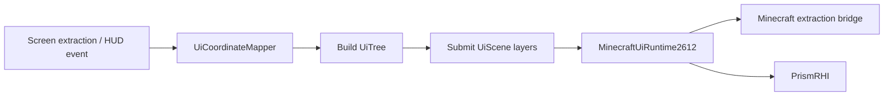

# Graven GUI 架构

> 公共 Lumin API、资源所有权和 Minecraft 接入边界见
> [Lumin GUI 集成边界](gui-library.md)。

## 业务宿主

Graven 的 GUI 由四类宿主组成：

- `PanelScreen`：模块浏览、Setting 编辑和客户端数据页。
- `DropdownScreen`：可拖动分类面板、搜索和 Setting 控件。
- `MainMenuScreen`：主菜单背景与操作入口。
- `HudEditorScreen`：HUD 布局、锚点、选择框和预览。

这些宿主持有业务状态和输入交互，不拥有另一套通用 GUI 库。几何、树、场景和文本类型直接来自
LuminGraphics；Minecraft runtime 适配来自 LuminGraphics-MC。

## 渲染链



每个 Screen 每帧只使用一个 `UiScene`。调用 `MinecraftUiRuntime2612.current()` 后先配置字体，
再在 `runtime.render(...)` 回调中构建和提交节点。Screen 移除或 runtime 变化时关闭旧 scene。

## Panel 与 Dropdown

Panel 业务组件位于 `gui/panel`，Dropdown 业务组件位于 `gui/dropdown`。Setting 的可见性、分组和
布局仍由 SettingHost 与相邻 controller/view 决定；公共 Lumin 树不读取 Module 或 Setting。

Popup 由宿主统一管理，使用 `UiLayer.POPUP`。滚动区域的 scissor 和滚动条必须提交到宿主 scene，
不得为每个 Panel 或列表创建独立 renderer。存在 painter order 的 background、content、floating 和
popup pass 必须使用显式相对 layer。

## HUD

`HudElementHolder` 在原版 HUD 提取结束后构建独立 HUD tree。每个启用的 `HudModule` 通过
`appendToTree` 向隔离的子 scope 追加节点，整棵树一次提交。HUD Editor 预览复用同一路径，并将
HUD tree 放在 editor chrome 的独立相对 layer；不得再逐元素调用独立 batch。

HUD 尺寸通过 `setBounds()` 更新，移动通过 anchor/move API 完成。HUD 的原版物品和其他
`GuiGraphicsExtractor` overlay 继续走 `renderOverlay`，不塞入 Lumin UI tree。

## 坐标和命中

所有 Screen 输入先通过 `UiCoordinateMapper` 转换到 Lumin 投影坐标。布局、文本测量、scissor 和
命中测试使用同一逻辑尺寸，不得额外除以 GUI scale。Dropdown 的拖动 delta 也必须转换到投影空间。

## 字体和主题

`ClientSetting.configureMinecraftFonts(runtime)` 统一注册默认字体、图标字体和其他 font id。
绘制与测量必须使用相同 font id 和 scale。业务色通过 `GravenUiTheme.lumin` 转换，不得在控件中
维护独立 atlas 或 renderer。自定义字体的相对值从 `.graven/fonts/` 和操作系统字体目录解析，
不使用 Minecraft 的当前运行目录。`Font Scale` 在 LuminGraphics-MC 的 UI 文字基准倍率上继续缩放，
对默认字体和自定义字体同时生效，并保持绘制与测量一致。

### Opal 视觉预设

`ClientSetting.ThemePreset.Opal` 是 Graven 原生视觉预设，不引入其他 GUI renderer。它继续使用
`UiTree`、`UiScene`、Minecraft blur region 和 PrismRHI，只在 `DropdownTheme` 中切换颜色、尺寸、
圆角、阴影和动画令牌。该预设固定使用深色表面；`Theme Mode` 不会将它转换为浅色主题。

Dropdown 渲染期间使用 `graven-opal-medium` 作为默认字体，标题显式使用
`graven-opal-bold`。一帧提交结束后必须调用
`ClientSetting.restoreMinecraftDefaultFont(runtime)` 恢复用户配置的默认字体，避免专用字体泄漏到
Panel、HUD 或原版界面。两个字体资源由 `ClientSetting.configureMinecraftFonts(runtime)` 注册，
绘制和测量仍共享 Lumin 的字体 loader 与 glyph atlas。

Opal 模式下，Dropdown 面板和顶部搜索框通过 `MinecraftBlurRegion2612` 请求圆角背景模糊；表面、
描边、青蓝渐变和文字仍由同一个 Dropdown `UiScene` 提交。主题在 Dropdown 内切换时必须重建面板，
使构造阶段创建的 Animation 同步采用新预设的时长。

### Dynamic Island 与搜索

`DynamicIsland` 是 Graven 的 `HudModule`，不是独立 Overlay 系统。它由 `HudElementHolder` 注册，
通过现有 HUD `UiTree` 进入共享 `UiScene`，并以顶部居中的 anchor 维护位置。默认状态使用
`textures/icons/client_band.png` 的透明 Graven Logo，显示 Graven、版本、服务器地址和当前玩家延迟；存在通知时切换为通知列表。默认宽度下限为 146 px，
避免短服务器地址右侧产生过量留白；较长地址仍按测量结果扩展。宽度和高度使用
`Easing.DYNAMIC_ISLAND` 的 250 ms 动画，并在每帧通过 `setBounds()` 提交动画后的真实尺寸。

Dynamic Island 表面使用低饱和、略增透的深色背景和青蓝强调色；透明 Logo 保持原始宽高比，
不会再拉伸旧的方形图标。

Dropdown 打开时，HUD 动态岛停止提交，由 Dropdown 自己在同一顶部位置绘制搜索状态。搜索框沿用
28 px 高度、13 px 圆角、模糊、表面和描边，并根据焦点与输入内容动态调整宽度。搜索图标、文字测量、
光标和 IME 坐标使用一致的 Opal font id；分类过滤仍由 `CategoryPanel.setSearchQuery()` 处理。
`OpalIslandStyle` 只保存两处共享的视觉令牌，不引入 EdOpal 的 trigger/overlay/renderer 架构。

### Opal HUD 与 ESP 组件

Opal 主题还为 `ModuleList`、`Notifications`、`TargetHUD` 和 `ESP2D` 提供专用绘制分支；完整的源码映射、
尺寸、动画、数据流与兼容性矩阵见
[EdOpal HUD 与 ESP 视觉迁移](development/edopal-visual-components-migration.md)。非 Opal 主题继续走原有分支。

Notifications 的 `Legacy` 模式由 HUD 元素绘制，`Island` 模式只允许 `DynamicIsland` 消费通知队列，
两条路径不得在同一帧重复显示。TargetHUD 和 ESP 的装备仍由 `GuiGraphicsExtractor.item` 提取，
其背景、文本和状态图标进入各自现有的 Lumin scene；物品坐标必须经 `UiCoordinateMapper` 转换。

## 验证

仓库当前不维护 GUI 测试源码。修改 Screen、HUD 或 layer 顺序后至少运行双平台编译，并启动受影响的
客户端路径检查坐标、字体、scissor 和 painter order：

```powershell
.\gradlew.bat :common:compileJava
.\gradlew.bat :fabric:compileJava :neoforge:compileJava
```
